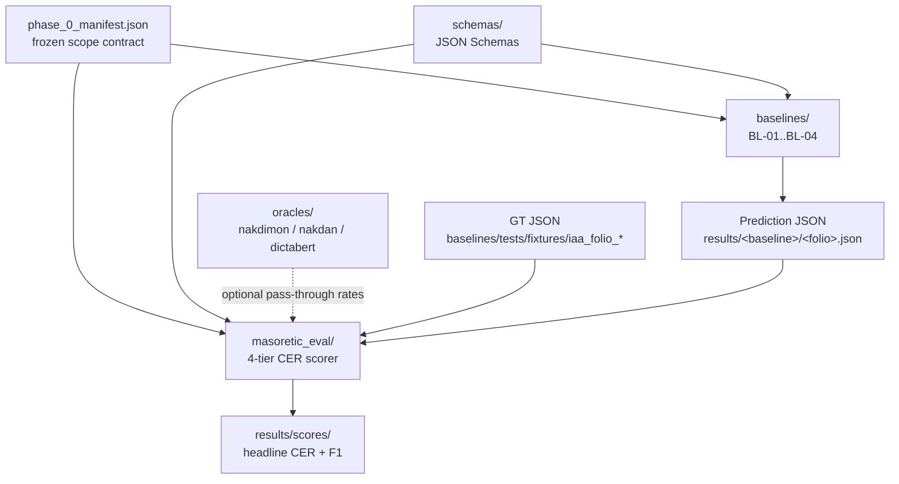

<!-- generated-by: gsd-doc-writer -->
# Architecture

## System overview

`masoretic-benchmark` is a 4-tier Character Error Rate (CER) scorer plus a public
benchmark dataset for OCR/HTR systems applied to medieval Hebrew manuscripts (the
Leningrad Codex Devarim folios in v0.1). The repository ships four loosely-coupled
Python packages — a scorer (`masoretic_eval`), four reference baseline scripts
(`baselines`), three diacritization oracles (`oracles`), and a JSON-Schema contract
set (`schemas`) — coordinated through a single frozen artifact, `phase_0_manifest.json`.
The scorer takes a ground-truth (GT) JSON and a prediction JSON, normalizes both,
aligns them at the UAX #29 grapheme-cluster level, and emits per-tier CER (tiers
1–3) plus F1 over meta-marks (tier 4) and a weighted composite headline. The repo
follows a layered, contract-driven style: schemas constrain inputs and outputs,
the scorer is pure, and the I/O-heavy baselines and oracles are siblings rather
than dependencies of the scorer.

## Component diagram



The dashed edge captures the v0.1 oracle integration mode: the scorer accepts
`--nakdimon-disagreement-rate` and `--dicta-disagreement-rate` as pass-through
floats, and the `oracles` package computes them externally. The scorer never
imports `oracles`.

## Data flow

A typical scoring run for one folio executes the following sequence:

1. **Manifest load.** `masoretic_eval.cli.score` reads
   `phase_0_manifest.json` (default path) via `masoretic_eval.manifest.Manifest.load`.
   The manifest hash is captured for embedding in the output JSON. The manifest
   declares the frozen folio set, the IAA subset (4 Leningrad Devarim folios:
   `F118B`, `F119A`, `F119B`, `F120A`), the pinned Kraken/Nakdimon/DictaBERT
   model hashes, the scorer version, and the cost caps.
2. **Input deserialization.** GT and prediction JSON files are parsed and
   validated against `masoretic_eval/schemas/scorer_input.schema.json`. The
   shape is `{"text": "<Hebrew>", "metamarks": [{type, verse_ref, ordinal,
   codepoints?}]}`. Metamark dicts are inflated to
   `MetaMarkRecord` dataclass instances.
3. **Normalization.** Both `text` strings pass through
   `masoretic_eval.normalize.normalize_for_scoring` — Unicode NFD followed by
   stripping of CGJ (U+034F). GT ships byte-for-byte UXLC LC-order; NFD at
   scoring time handles shin/sin presentation forms (U+FB2A–FB2D) as composition
   exclusions.
4. **Tier dispatch.** `masoretic_eval.composite.Scorer.score` calls each tier
   implementation in `masoretic_eval/tiers/` in turn. Tiers 1–3 reduce to a
   shared CER kernel after tier-specific stripping; tier 4 is set-based F1.
5. **Cluster-aligned CER (tiers 1–3).** `masoretic_eval.metrics.cer.cluster_aligned_cer`
   segments both strings into UAX #29 grapheme clusters via
   `masoretic_eval.segment.segment_clusters` (which delegates to the
   `grapheme` PyPI package), aligns clusters with a Needleman–Wunsch DP whose
   gap cost equals each cluster's codepoint count, then computes per-pair
   codepoint-level Levenshtein distance using `rapidfuzz.distance.Levenshtein`.
   Edits sum across the alignment; the denominator is total GT codepoints.
6. **Tier 4 F1.** `masoretic_eval.tiers.tier4_metamarks.Tier4MetaMarks` matches
   GT and prediction `MetaMarkRecord`s on the 3-tuple `(type, verse_ref,
   ordinal)`. Exact matches earn 1 TP; `(type, verse_ref)` matches with the
   wrong ordinal earn `1/3` TP (`PARTIAL_CREDIT = 1.0 / 3.0`).
7. **Diagnostics.** Tier 2's diagnostics dict is enriched with Nakdimon-style
   factoring (`dec`/`cha`/`wor`/`voc`) from
   `masoretic_eval.metrics.nakdimon.nakdimon_factoring`, plus a nikkud confusion
   matrix from `masoretic_eval.metrics.confusion.build_nikkud_confusion`.
   The two oracle pass-through fields (`nakdimon_disagreement_rate`,
   `dicta_disagreement_rate`) are stored verbatim from CLI kwargs.
8. **Composite.** `compute_cer3(t1, t2, t3)` applies the fixed weights
   `(0.5, 0.3, 0.2)` to produce the headline `cer3`. Tier 4 is reported
   separately, never folded into the composite.
9. **Serialization.** `masoretic_eval.output_schema.serialize` emits the final
   JSON object with `prediction_id`, `gt_version`, `manifest_hash`,
   `scorer_version` (`__version__` = `0.2.0`), the four tier blocks, the
   composite, the confusion matrices, and the standard caveats array. The
   file is written with `indent=2, ensure_ascii=False` so Hebrew is human-readable.

## Key abstractions

| Abstraction | Location | Purpose |
|---|---|---|
| `Scorer` | `masoretic_eval/composite.py` | Top-level entry point; orchestrates the four tiers, Nakdimon factoring, and the composite. Constructed via `Scorer.from_config("v0.1")`. |
| `Tier` (ABC) + `TierResult` | `masoretic_eval/tiers/base.py` | Common tier interface; each tier implements `score(gt, pred) -> TierResult`. `TierResult` carries either `cer/edits/denominator` (tiers 1–3) or `f1/precision/recall` (tier 4) plus a `diagnostics` bag. |
| `Tier1Consonantal` / `Tier2Nikkud` / `Tier3Trop` / `Tier4MetaMarks` | `masoretic_eval/tiers/tier{1..4}*.py` | Tier-specific stripping policies (consonants only / consonants+nikkud+sin-shin dots / full / metamark records). |
| `cluster_aligned_cer` | `masoretic_eval/metrics/cer.py` | The shared CER kernel. Cluster alignment unit, codepoint edit unit. |
| `segment_clusters` | `masoretic_eval/segment.py` | UAX #29 grapheme-cluster iterator (single source of truth for the alignment unit). |
| `MetaMarkRecord` | `masoretic_eval/uxlc_loader.py` | Frozen dataclass for tier-4 records: `(type, verse_ref, ordinal, codepoints?)`. |
| `Manifest` + `Folio` | `masoretic_eval/manifest.py` | Reader/validator for `phase_0_manifest.json`, including v0.1→v0.2 in-memory coercion. Computes the manifest hash that gets embedded in every score output. |
| `BaselineBase` | `baselines/src/baselines/_base.py` | Template-method ABC for the four baselines. Locked `run()` lifecycle: preflight → sandbox → per-folio scope check → `infer_folio` (the only abstract method) → expected-total validation → atomic promote. |
| Oracle modules (`nakdimon_oss`, `nakdan_hybrid`, `dictabert`) | `oracles/src/oracles/*.py` | Independent diacritization clients. Output disagreement rates that the scorer accepts as pass-through inputs. |

## Directory structure rationale

The repository separates **scoring logic** (pure, deterministic) from
**baseline execution** (I/O-heavy, model-dependent) from **oracle clients**
(network-dependent, possibly non-reproducible). Each lives in its own
installable Python package so external contributors can adopt the scorer
alone or a single oracle without pulling in the rest.

```
masoretic-benchmark/
├── masoretic_eval/         # Scorer package (Apache-2.0). Pure: no network, no models.
│   ├── cli.py              # `masoretic-eval score` entry point (Click).
│   ├── composite.py        # Scorer + ScoreResult + cer3 weights.
│   ├── normalize.py        # NFD + CGJ stripping.
│   ├── segment.py          # UAX #29 grapheme-cluster segmentation.
│   ├── tiers/              # tier1_consonantal, tier2_nikkud, tier3_trop, tier4_metamarks.
│   ├── metrics/            # cer (cluster-aligned), confusion (nikkud), nakdimon (factoring).
│   ├── schemas/            # scorer_input.schema.json + phase_0_manifest.schema.json.
│   ├── manifest.py         # phase_0_manifest.json reader/validator.
│   ├── output_schema.py    # ScoreResult → spec-compliant JSON.
│   ├── uxlc_loader.py      # UXLC XML → verses + MetaMarkRecord list (qere default, ketiv fallback).
│   ├── page_xml.py         # PAGE-XML helper for baselines.
│   └── segment.py / composite.py / manifest.py
├── baselines/              # Four reference baselines (BL-01..BL-04).
│   ├── src/baselines/
│   │   ├── _base.py        # BaselineBase template-method ABC (locked run()).
│   │   ├── _gt_adapter.py  # GT fixture adapter (PAGE-XML → tier-1 GT JSON).
│   │   ├── _kraken.py      # BiblIA Kraken segmentation client.
│   │   ├── _llm_clients.py # Anthropic + Google clients for BL-01.
│   │   ├── _llm_combine.py # BL-01 combine logic (Claude+Gemini).
│   │   ├── _llm_replay.py  # Hash-keyed replay for offline CI.
│   │   ├── biblia_kraken.py        # BL-02
│   │   ├── biblia_nakdimon.py      # BL-03 (Kraken→Nakdimon chain)
│   │   ├── biblia_char_menaked.py  # BL-04 (Kraken→DictaBERT chain, off-label)
│   │   ├── llm_vision.py           # BL-01 (Claude+Gemini vision)
│   │   └── run.py                  # CLI runner for any baseline.
│   ├── tests/fixtures/     # 4 IAA folio GT JSONs + PAGE-XML, llm_calls/ replays.
│   ├── EVALUATION_PROTOCOL.md      # Pre-registered headline-metric protocol.
│   ├── KRAKEN_PIN.md / LLM_PIN.md  # Append-only pin logs.
│   └── pyproject.toml      # Independent package: `masoretic-baselines`.
├── oracles/                # Three diacritization clients.
│   ├── src/oracles/
│   │   ├── nakdimon_oss.py # Primary, MIT, reproducible (MODEL_HASH-pinned).
│   │   ├── nakdan_hybrid.py # DICTA Nakdan API (1 QPS throttle + JSONL audit log).
│   │   ├── dictabert.py    # Off-label `dictabert-large-char-menaked` for BL-04.
│   │   ├── compute_oracles.py # Composite caller — emits both rates for scorer CLI.
│   │   ├── _audit.py / _hashing.py / _strip.py / _throttle.py
│   ├── audit/              # DICTA daily-rotated JSONL audit logs (gitignored).
│   ├── NAKDIMON_PIN.md     # Append-only Nakdimon model-version pin log.
│   └── pyproject.toml      # Independent package: `masoretic-oracles`.
├── schemas/                # External-facing JSON Schemas + changelogs.
│   ├── baseline_prediction.schema.json   # Per-baseline prediction format.
│   ├── phase_0_manifest.schema.json      # Frozen-scope contract.
│   ├── run_meta.schema.json              # Per-baseline run_meta.json shape.
│   ├── phase_0_manifest.changelog.md     # Append-only manifest changelog.
│   └── PREDICTION_SCHEMA_CHANGELOG.md    # Append-only prediction-schema changelog.
│                           # results/ is absent in v0.1: baselines are deferred
│                           # to v0.1.1 (see README "Baselines"). When promoted, a
│                           # baseline writes results/<baseline_id>/<folio>.json +
│                           # run_meta.json, and scores land in results/scores/.
├── tests/                  # Scorer test suite (pytest).
│   ├── test_tier{1..4}.py / test_cer.py / test_segment.py / test_normalize.py
│   ├── test_external_crossval.py   # Anti-self-grading: scorer vs naive Levenshtein.
│   ├── test_manifest*.py           # Manifest schema, immutability, hash-artifact gates.
│   ├── test_release_smoke.py       # Release-time smoke test.
│   ├── release/                    # Reserved for release-gate tests.
│   └── fixtures/                   # cli_gt.json, cli_pred.json, golden/, uxlc_deut_6.xml, etc.
├── scripts/                # Operational scripts.
│   ├── check_version_cascade.py    # Version-bump cascade gate.
│   ├── manifest_immutable.py       # Manifest immutability gate (append-only changelog).
│   ├── reject_binaries.py / reject_private_paths.py # Pre-commit guards.
│   └── release/                    # Reserved for release-time scripts.
├── phase_0_manifest.json   # Frozen scope contract (top-level, hashed into every score).
├── pyproject.toml          # Top-level scorer package metadata.
├── pytest.ini / .pre-commit-config.yaml / .python-version (3.11)
└── README.md / LICENSE
```

The four sibling packages (`masoretic_eval`, `baselines`, `oracles`, plus the
schema-only `schemas/`) communicate only through three frozen contracts:

1. **`phase_0_manifest.json`** — append-only, hashed, validated against
   `masoretic_eval/schemas/phase_0_manifest.schema.json`. Defines folio scope,
   IAA subset, pinned model hashes, and cost caps. Read by the scorer (for
   the embedded `manifest_hash`) and by every baseline (for scope checks).
2. **`schemas/baseline_prediction.schema.json`** — defines the per-baseline
   prediction JSON shape that gets written to `results/<baseline_id>/<folio>.json`
   and consumed by the scorer.
3. **JSON-only oracle pass-through** — the scorer's CLI accepts
   `--nakdimon-disagreement-rate` and `--dicta-disagreement-rate` as floats.
   Oracle integration (running the actual models, computing the rate) lives
   in `oracles/`; the scorer treats the values as opaque inputs and emits
   them unchanged in `tier2.diagnostics`.

### Cross-validation against PyICU and naive Levenshtein

To guard against self-grading, the test suite cross-validates two of the
scorer's key primitives against independent implementations:

- **Segmentation** (`tests/test_segment.py::test_pyicu_agrees_with_grapheme_on_hebrew_fixture`):
  the `grapheme`-package output must match PyICU's `BreakIterator.createCharacterInstance(Locale("he"))`
  on a Hebrew fixture. PyICU is an optional dev dependency
  (`PyICU>=2.11; platform_system != 'Windows'`) so the test skips when PyICU
  is unavailable; CI installs `libicu-dev` + `pkg-config` in every test job
  in `.github/workflows/ci.yml`, so the cross-validation runs on every PR.
- **Edit distance** (`tests/test_external_crossval.py`): the scorer's
  `cluster_aligned_cer` must agree with a hand-rolled O(n·m) naive
  Levenshtein implementation on identical-cluster-count fixtures, and must
  be an upper bound on cluster-mismatch fixtures (cluster boundaries add
  alignment constraints that the codepoint-flat baseline lacks).

### Qere/ketiv handling

`masoretic_eval/uxlc_loader.py::load_uxlc` walks UXLC XML at the verse level
and treats `<k>` (ketiv) and `<q>` (qere) as siblings of `<w>` inside `<v>`.
The default policy is **score against qere**: when a `<q>` sibling follows
a `<k>`, only the `<q>` text is appended to the verse string. If a `<k>`
appears with no following `<q>` (end of verse, paragraph marker, or another
`<w>`), the loader emits a warning and falls back to the ketiv text — the
word is never silently dropped. This policy is reflected in the output JSON
under `qere_ketiv_policy: "score_against_qere"` and is informational-only
in the `UXLCDoc` dataclass; it is not configurable in v0.1.

### Oracle pass-through fields

Per `masoretic_eval/composite.py::Scorer.score`, the scorer accepts two
optional kwargs — `nakdimon_disagreement_rate` and `dicta_disagreement_rate`
— and writes them verbatim into `tier2.diagnostics`. The rates are computed
externally by `oracles.compute_oracles.compute_oracle_rates` (Nakdimon + DICTA
Nakdan over per-line tier-2 strings, arithmetic mean per folio). The
scorer's output `caveats` array makes the asymmetry explicit:

- Nakdimon is the reproducible canonical signal (MIT, MODEL_HASH-pinned),
  indicative not ground truth;
- DICTA is a proprietary best-available comparison, not reproducible due
  to a rotating endpoint with no version header.

The DictaBERT char-menaked oracle (`oracles/src/oracles/dictabert.py`) is
**off-label** for pre-modern Tiberian text and is used only as the BL-04
publishable negative-result baseline; the disclaimer is pinned verbatim in
the module docstring, the oracle README, the BL-04 baseline module, and
the baselines README, with a `ruff` per-file-ignore for `E501` to preserve
the verbatim wording.

### The 4 IAA folios fixture set

The Inter-Annotator Agreement (IAA) subset is fixed at four sides of the
Leningrad Codex book of Devarim (Deuteronomy): `F118B`, `F119A`, `F119B`,
`F120A`. They appear in three places:

1. `phase_0_manifest.json::iaa_subset` — the canonical declaration, paired
   with per-folio `image_url` references to `archive.org/download/leningrad-codex-color/BIB_LENCDX_<folio>.jpg`
   (WSRP photographs; rights asserted by WSRP; IIIF-reference-only, never redistributed).
2. `baselines/tests/fixtures/iaa_folio_leningrad_devarim_<F>_fixture.{page.xml,gt_adapter_golden.json}`
   — the tier-1 GT (F118B hand-transcribed by Open Masorah; F119A/B/120A from UXLC 2.5) plus the source PAGE-XML.
3. `results/<baseline_id>/leningrad_devarim_<F>_fixture.json` — the frozen
   per-baseline prediction; `results/scores/leningrad_devarim_<F>_fixture.json`
   holds the headline CER + F1.

In v0.1 only `F118B` has a complete predictions-and-scores set across all
four baselines; `F119A`/`F119B`/`F120A` apply the same pre-registered
methodology cold (no per-folio tuning) as the IAA set is scored. The
pre-registration commitment is documented in
`baselines/EVALUATION_PROTOCOL.md` (append-only).
